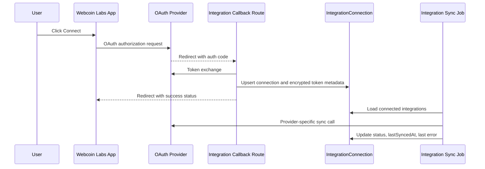

# Deployment Architecture

This document defines how Webcoin Labs should run across local, staging, and production environments.

## Environment Topology

```mermaid
flowchart TB
    subgraph Local["Local Developer Machine"]
        DevBrowser["Browser : http://localhost:3000"]
        DevApp["Next.js Dev Server"]
        DevDB[("Postgres (dev)")]
        DevStorage["Local Storage or R2 Dev Bucket"]
        DevApp --> DevDB
        DevApp --> DevStorage
        DevBrowser --> DevApp
    end

    subgraph Staging["Staging Environment"]
        StageUsers["Internal QA Users"]
        StageApp["Web App (staging deployment)"]
        StageMiddleware["Auth Middleware"]
        StageDB[("Postgres (staging)")]
        StageStorage["R2 Staging Bucket"]
        StageJobs["Internal Job Routes"]
        StageProviders["OAuth and Native Providers"]

        StageUsers --> StageApp
        StageApp --> StageMiddleware
        StageApp --> StageDB
        StageApp --> StageStorage
        StageJobs --> StageDB
        StageJobs --> StageProviders
        StageApp --> StageProviders
    end

    subgraph Production["Production Environment"]
        Users["Public Users"]
        Web["App Domain + Marketing Domain"]
        App["Next.js App Router (prod)"]
        Middleware["Route/Auth Middleware"]
        Actions["Server Actions + API Routes"]
        DB[("Postgres (prod)")]
        R2["Cloudflare R2 (prod)"]
        Supabase["Supabase Auth"]
        Providers["GitHub, Google, Notion, Atlassian, Calendly, OpenClaw"]
        Scheduler["Cron/Scheduler"]
        SyncJob["/api/internal/jobs/integration-sync"]
        Audit["Audit and Policy Layer"]

        Users --> Web
        Web --> App
        App --> Middleware
        App --> Actions
        Actions --> DB
        Actions --> R2
        Actions --> Supabase
        Actions --> Providers
        Actions --> Audit

        Scheduler --> SyncJob
        SyncJob --> Providers
        SyncJob --> DB
        SyncJob --> Audit
    end
```

## External Callback and Sync Paths

## Domain and Routing

- Marketing can live on apex domain.
- App runs on app subdomain.
- Auth callback endpoints stay on app domain.

Example:
- `https://webcoinlabs.com` (marketing)
- `https://app.webcoinlabs.com` (authenticated app)
- `https://app.webcoinlabs.com/api/integrations/callback/[provider]`

## Required Secrets by Environment

## Local
- `.env.local`
- Use dev callbacks and dev provider apps

## Staging
- Isolated provider apps and callback URLs
- Dedicated staging database and storage buckets
- Dedicated internal jobs secret

## Production
- Production provider apps and callback URLs
- Production DB and storage only
- Rotated encryption and jobs secrets

## Operational Guardrails

- Never share production secrets with staging/local.
- Keep provider callback URLs environment-specific.
- Run integration sync on schedule with internal auth header.
- Capture sync errors in audit logs and surface in settings UI.
- Keep role and ownership checks enforced server-side in all environments.
