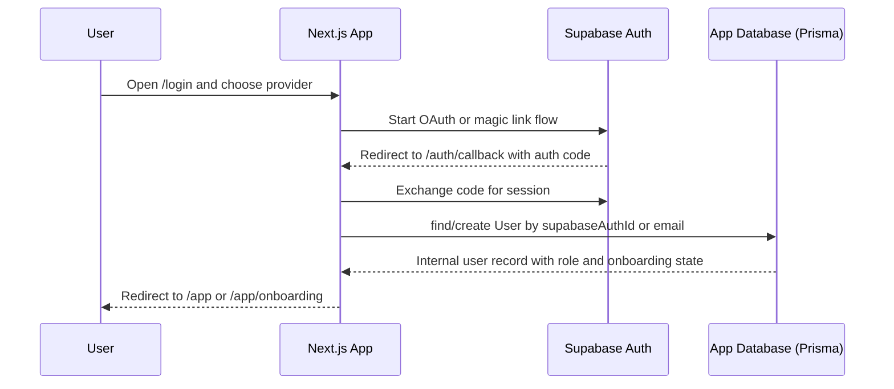
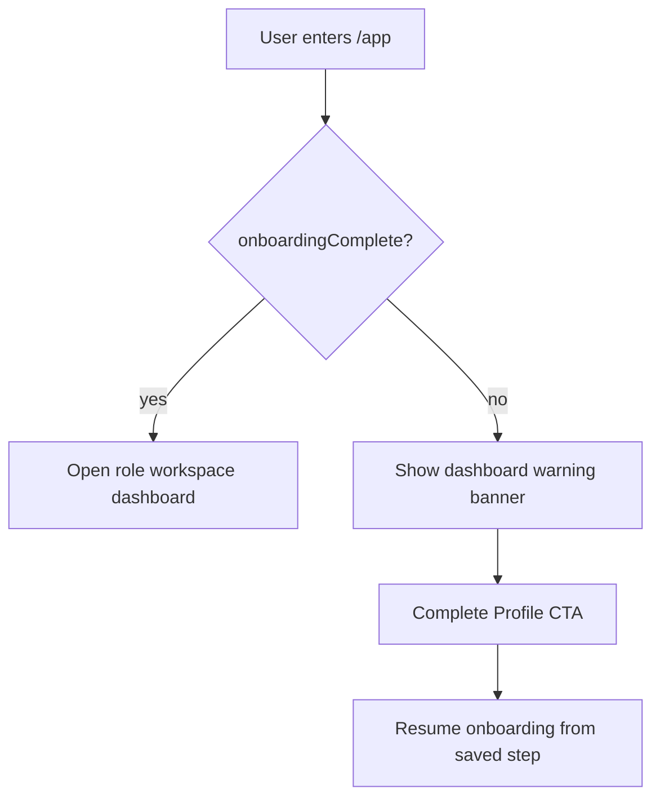
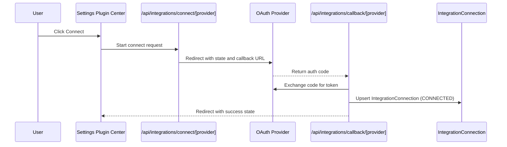
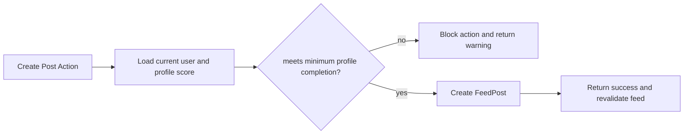
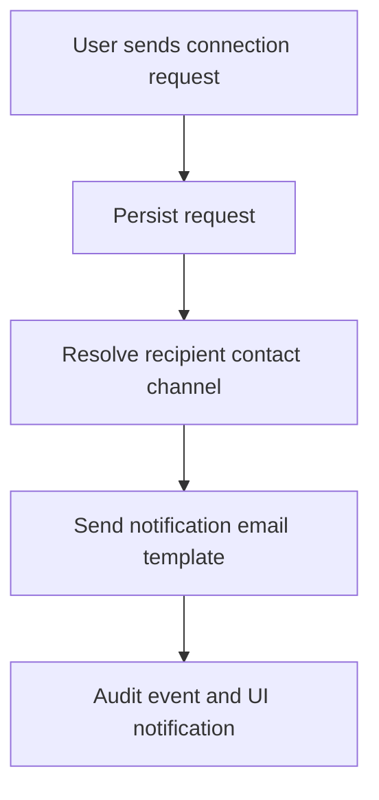
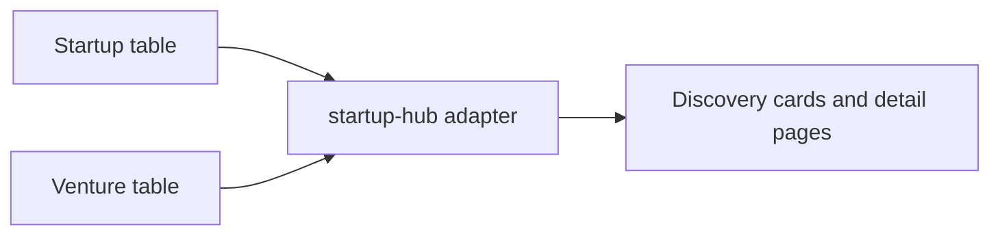

# Request and Data Flows

## 1) Authentication Flow

## 2) Onboarding Continuation Flow

## 3) Integration Plugin Flow

## 4) Feed Publishing Guard Flow

## 5) Connection Request Notification Flow

## 6) Startup and Venture Read Adapter Flow

This adapter keeps route compatibility while moving to canonical read models.
