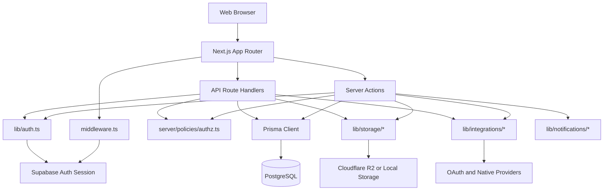
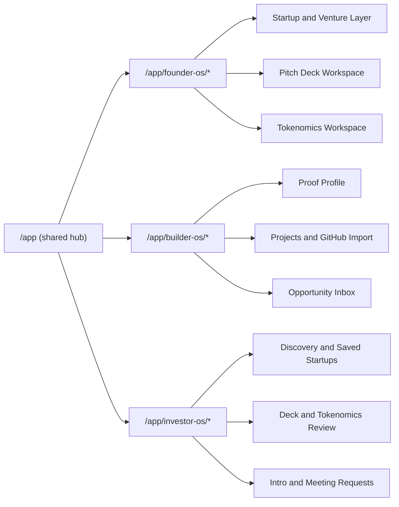

# System Design

## Platform Shape

Webcoin Labs is a role-aware ecosystem hub with one shared graph:
- Builder identity and proof
- Founder startup pages and execution
- Investor discovery and review
- Shared execution feed
- Utility tools: Pitch Deck and Tokenomics

The platform uses Supabase for authentication and Prisma/Postgres for product data.

## Runtime Architecture

## Role Surfaces

## Security and Ownership

- Authentication is externalized to Supabase.
- Product identity remains internal (`User` and role profiles).
- Authorization is enforced in server actions and route handlers.
- Ownership checks gate edits to profiles, ventures, decks, and tokenomics.
- Public profile routes are read-safe and visibility-aware.

## Design Constraints

- Keep routes stable.
- Prefer additive refactors over destructive rewrites.
- Keep shared graph entities canonical, and legacy bridges temporary.
