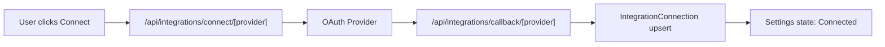

# Integrations Setup (Production Ready)

This guide defines plugin setup, provider credentials, callback URLs, and what is automatic versus manual.

## Plugin Model

Webcoin Labs treats integrations as plugins:

- OAuth plugins: full connect flow with token storage
- Native plugins: platform-managed integrations
- Manual plugins: no OAuth yet, user-managed linkage

Current modes:

- OAuth: GitHub, Gmail, Google Calendar, Notion, Jira, Calendly
- Native: OpenClaw, Telegram, Wallet
- Manual: Cal.com, Farcaster

## Required Environment Variables

Set in `.env.local` for local and in your deployment environment for production.

```env
# Core
DATABASE_URL=
NEXTAUTH_URL=http://localhost:3000
NEXTAUTH_SECRET=
APP_ENCRYPTION_SECRET=
INTERNAL_JOBS_SECRET=

# Supabase auth
NEXT_PUBLIC_SUPABASE_URL=
NEXT_PUBLIC_SUPABASE_ANON_KEY=

# OAuth providers
GITHUB_CLIENT_ID=
GITHUB_CLIENT_SECRET=

GOOGLE_CLIENT_ID=
GOOGLE_CLIENT_SECRET=

NOTION_CLIENT_ID=
NOTION_CLIENT_SECRET=

ATLASSIAN_CLIENT_ID=
ATLASSIAN_CLIENT_SECRET=

CALENDLY_CLIENT_ID=
CALENDLY_CLIENT_SECRET=

# OpenClaw
OPENCLAW_BASE_URL=
OPENCLAW_API_KEY=
```

## Where to Get Client IDs and Secrets

### GitHub

- Path: GitHub -> Settings -> Developer settings -> OAuth Apps -> New OAuth App
- Gives:
  - `GITHUB_CLIENT_ID`
  - `GITHUB_CLIENT_SECRET`
- Callback URL:
  - `http://localhost:3000/api/integrations/callback/github`

### Google (Gmail and Calendar)

- Path: [Google Cloud Console](https://console.cloud.google.com/) -> APIs and Services -> Credentials -> Create Credentials -> OAuth client ID (Web application)
- Gives:
  - `GOOGLE_CLIENT_ID`
  - `GOOGLE_CLIENT_SECRET`
- Required:
  - Authorized JavaScript origins:
    - `http://localhost:3000`
    - your production origin
  - Authorized redirect URI:
    - `http://localhost:3000/api/integrations/callback/google`

### Notion

- Path: [Notion Developers](https://www.notion.so/profile/integrations) -> create public integration
- Gives:
  - `NOTION_CLIENT_ID`
  - `NOTION_CLIENT_SECRET`
- Callback URL:
  - `http://localhost:3000/api/integrations/callback/notion`

### Jira (Atlassian)

- Path: [Atlassian Developer Console](https://developer.atlassian.com/console/myapps/) -> create OAuth 2.0 app (3LO)
- Gives:
  - `ATLASSIAN_CLIENT_ID`
  - `ATLASSIAN_CLIENT_SECRET`
- Callback URL:
  - `http://localhost:3000/api/integrations/callback/jira`

### Calendly

- Path: [Calendly Developer Portal](https://developer.calendly.com/) -> create OAuth app
- Gives:
  - `CALENDLY_CLIENT_ID`
  - `CALENDLY_CLIENT_SECRET`
- Callback URL:
  - `http://localhost:3000/api/integrations/callback/calendly`

### OpenClaw

- Path: your OpenClaw deployment admin portal
- Gives:
  - `OPENCLAW_BASE_URL`
  - `OPENCLAW_API_KEY`
- Also needed for Telegram control:
  - Telegram bot token entered in Webcoin Labs settings

## Callback Overview



## What Connect Does

In Settings -> Plugin Center:

- OAuth providers:
  - start OAuth
  - exchange code for token
  - encrypt and store token metadata
  - mark status as `CONNECTED`

- OpenClaw and Telegram:
  - configure workspace bridge and sync
  - allow reply and thread sync flows

- Wallet:
  - save network and address identity in `WalletConnection`

## Manual Setup Plugins

These are intentionally non-OAuth at the moment:

- Cal.com
- Farcaster

They should show clear manual state and not pretend to be fully synced OAuth providers.

## Security Notes

- OAuth state is signed and short-lived.
- Stored tokens are encrypted at rest.
- Disconnect clears provider token metadata and sync timestamps.
- Internal sync job requires `INTERNAL_JOBS_SECRET`.

## Sync Jobs

### User-triggered
- Settings page action: Sync Plugins Now

### Internal scheduled
- Endpoint: `POST /api/internal/jobs/integration-sync`
- Required header:
  - `x-webcoinlabs-job-secret: <INTERNAL_JOBS_SECRET>`

Example:

```bash
curl -X POST "https://your-domain.com/api/internal/jobs/integration-sync" \
  -H "x-webcoinlabs-job-secret: ${INTERNAL_JOBS_SECRET}"
```

Recommended cadence:
- every 10 to 15 minutes

## Provider Readiness Matrix

- GitHub: OAuth and token persistence implemented
- Gmail: OAuth via Google implemented
- Google Calendar: OAuth via Google implemented
- Notion: OAuth implemented
- Jira: OAuth implemented
- Calendly: OAuth implemented
- OpenClaw: native integration implemented
- Telegram: native via OpenClaw implemented
- Wallet: native connection record implemented
- Cal.com: manual
- Farcaster: manual

## Quick QA Checklist

1. Sign in with Supabase-authenticated session.
2. Open `/app/settings`.
3. Connect each OAuth provider and confirm connected status.
4. Disconnect each provider and confirm disconnected status.
5. Trigger manual sync and confirm `lastSyncedAt` updates.
6. Validate role workspaces show same plugin status.
