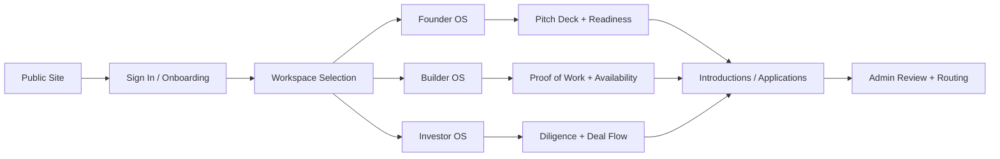
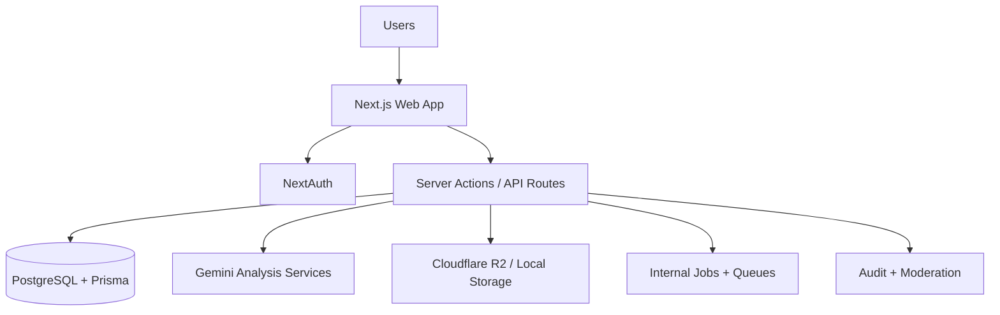

# Webcoin Labs

Webcoin Labs is a venture operating platform that helps founders, builders, investors, and ecosystem teams work in one place.

Instead of fragmented tools, Webcoin Labs gives users one shared system for profile identity, discovery, collaboration, pitch intelligence, and execution workflows.

## What Webcoin Labs Includes

- Founder workspace for venture setup, readiness, and investor pipeline
- Builder workspace for proof of work, visibility, and opportunity matching
- Investor workspace for discovery, diligence, and decision flow
- Admin controls for curation, moderation, routing, and auditability
- Public profile layer for founder, builder, and investor discovery

## Who It Is For

- Founders launching and scaling Web3/Web2 products
- Builders looking for high-signal teams and projects
- Investors managing deal flow and founder evaluation
- Ecosystem partners supporting launches and distribution

## How The Platform Works



## High-Level System Design



## Live Surfaces

- Marketing: `https://webcoinlabs.com`
- App entry: `https://app.webcoinlabs.com/login`
- App domain: `https://app.webcoinlabs.com`

### Domain Behavior

- Main site stays on `webcoinlabs.com`
- Authentication and workspace access run on `app.webcoinlabs.com`
- `/login` from apex domain is redirected to app subdomain login

## Core Experience

### Founder

- Build founder and venture profile
- Upload pitch deck and generate AI review
- Manage applications, intros, and execution pipeline

### Builder

- Maintain public builder profile
- Showcase capability and project proof
- Connect with relevant founder opportunities

### Investor

- Discover high-signal founders and projects
- Track diligence notes and decisions
- Manage pipeline and status transitions

### Admin

- Review submissions and moderate uploads
- Route opportunities and enforce policies
- Track critical actions with audit trails

## Security and Reliability Principles

- Role-based access controls across privileged paths
- Server-side validation for sensitive actions
- Upload moderation and status controls
- Environment-based runtime safeguards
- Audit events on key administrative and decision actions

## For Developers (Quick Start)

If you are contributing to the product:

```bash
pnpm install
pnpm db:generate
pnpm db:migrate
pnpm dev
```

Production build check:

```bash
pnpm build
```

Mandatory release gate before deploy:

```bash
pnpm release:gate
```

See full checklist: `docs/release-checklist.md`.

## Environment Setup

Use local environment files only (do not commit secrets):

- `.env`
- `.env.local`

Minimum required values are validated in `lib/env.ts`.

## Repo Structure (Simple View)

- `app/` - routes, pages, server actions
- `components/` - UI and feature components
- `lib/` - shared runtime, auth, storage, AI, utilities
- `prisma/` - schema and migrations
- `server/` - services, selectors, and policy layer

## Contact

- Website: [https://webcoinlabs.com](https://webcoinlabs.com)
- Product access: [https://app.webcoinlabs.com/login](https://app.webcoinlabs.com/login)

